# RestMin_v1_solver
本工程使用 强化学习框架 [Stable-Baselines3](https://stable-baselines3.readthedocs.io/en/master/guide/install.html)。

试玩地址：[链接]()（修复中：1️⃣引入tensorflowJS库报错 2️⃣Cocos Creator本地运行正常，但项目构建报错）。

## 环境介绍
该环境是一种中国古代棋的简化/魔改版本，分为两种模式，模式0是简化，模式1是魔改。
玩家经过一系列动作，减少棋盘中的棋子，终局时棋子剩得越少，得分越高。
<ul>
<li>模式0下，棋子皆为单色。棋子可以以相邻棋子作为跳板进行移动，移动后，跳板棋子移除。</li>
<li>模式1下，有双色棋子，棋子的移动规则同模式0，但只有跳板棋子与跳跃棋子同色时，才会被移除，反之会被保留。由于合法动作大量增加，探索和开采的难度显著提升。</li>
</ul>

| 模式 0 | 模式 1 |
| :---: | :---: |
|  | 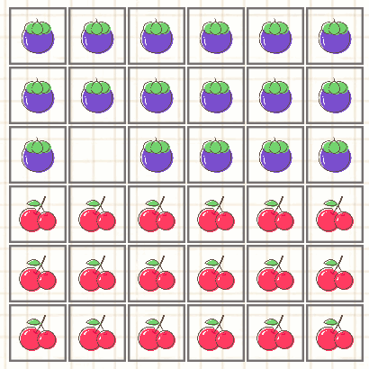 |

### 🌈最终效果展示
| 模式 1 随机 | 模式 1 well-trained|
| :---: | :---: |
| 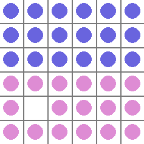 | 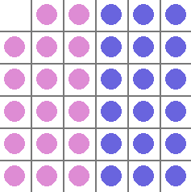 |

### 终局条件
该棋的游玩环境和训练环境有着不同的终局条件。在[游玩环境](https://github.com/wwsyan/RestMin_v1_solver/blob/main/env/gameRaw.js#L296)中，
终局判断函数会按顺序进行以下的判定：
<ol>
<li>若不存在合法动作，则死局（<b>第一死局充分条件</b>）；</li>
<li>若存在同色棋子消除，则非死局（<b>非死局充分条件</b>）；</li>
<li>
  对于两个同色棋子 $(x_1,y_1)$ 和 $(x_2,y_2)$，若不满足（ $\bmod$ 指取余）：
  $|x_1-x_2|=0 \land |y_1-y_2|\bmod2=1$ 或
  $|y_1-y_2|=0 \land |x_1-x_2|\bmod2=1$ 或
  $|x_1-x_2|=1 \land |y_1-y_2|\bmod2=0$ 或
  $|y_1-y_2|=1 \land |x_1-x_2|\bmod2=0$，
  那么该同色的棋子对无法进行同色消除。
  遍历所有同色的棋子对，若全都无法进行同色消除，那么死局（<b>第二死局充分条件</b>）；
</li>
<li>启用递归算法，遍历未来一定步数内的所有状态，并进行非死局充分条件的判定，若存在非死局状态，则判定为非死局。</li>
</ol>

使用该组合判定的原因是：
<ol>
<li>未找到死局的充分必要条件，只找到一些充分条件；</li>
<li>可以仅使用一个足够深的递归判定来满足需要，但会带来较严重的卡顿，影响体验。</li>
</ol>

由于上述组合判定有着一定的计算负担，会较大地影响训练速度。因此，在[训练环境](https://github.com/wwsyan/RestMin_v1_solver/blob/main/env/env_pure.py#L181)中，
终局条件简化为：
<ol>
<li>若不存在合法动作，则死局（<b>第一死局充分条件</b>）；</li>
<li>若已行动步数达到50步，则死局。</li>
</ol>

### 奖励
在标准版本中，奖励只有在终局时获得，其余状态下都是0。如果最终达到了最优解，即剩余最少的棋子数，那么将获得有区分度的大奖励
（[Code](https://github.com/wwsyan/RestMin_v1_solver/blob/main/env/env_pure.py#L184)）。

### 观测空间与动作空间
对于 $6×6$ 的棋盘， 模式 0 和 模式 1 的 $observation$ 分别是 <code>MultiBinary(36)</code> 和 <code>MultiBinary(72)</code>；
$action$ 是 <code>Discrete(36*4)</code>，意为选中一个位置的棋子，并进行上下左右四个方向的移动，由于有大量不合法动作，所以训练时要使用动作掩码
（[Code](https://github.com/wwsyan/RestMin_v1_solver/blob/main/env/env_pure.py#L153)）。

## 模式0
### 标准PPO
使用标准PPO作为基线，分别测试在 $4×4$， $5×5$ 和 $6×6$ 棋盘下的性能
（[Code](https://github.com/wwsyan/RestMin_v1_solver/blob/main/ppo_baseline/run.py)）。
| 幕长 | 幕奖励 | 说明 |
|:---:|:---:|:---:|
|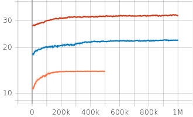|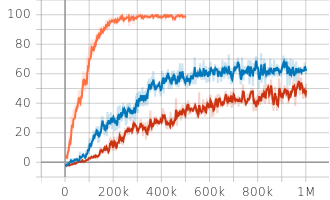| 橙： $4×4$  蓝： $5×5$  红： $6×6$ |

在小棋盘下，PPO较好地实现了所有初始位置下的最优解轨迹。但随着棋盘的扩大，比例下降。

### 技巧：数据增强
首先值得考虑的trick是数据的等效性，让所有等价的幕轨迹一同参与模型的训练，应当是十分有效的。
等价的状态由旋转和镜像组合，一共8种。
我们需要在收集到一个batch数据后，对这组数据进行加工，再把加工好的数据传输给训练模块。
具体来说（[Code](https://github.com/wwsyan/RestMin_v1_solver/blob/main/ppo_da/callback_da.py#L7)），
我们要使用<code>Stable-Baselines3</code>中的自定义<code>Callback</code>函数来参与训练流程，操作<code>rollout_buffer</code>中的下列数据：
<ul>
  <li>扩展 <code>observations</code>, <code>actions</code> 和 <code>action_masks</code>.</li>
  <li>扩展/共享 <code>episode_starts</code> and <code>rewards</code>.</li>
  <li>重新计算 <code>values</code> and <code>log_probs</code>.</li>
  <li>重新计算 <code>returns</code> and <code>advantages</code>.</li>
</ul>

或者可以看看另一个 $action$ 更简单的走迷宫的例子：[Code](https://github.com/wwsyan/SB3_practice#maze-by-maskable-ppo-with-data-augment)。

经过实验，数据增强（DA）对训练速度和训练效果都提升较大：
| $4×4$ | $5×5$ | $6×6$ |
|:---:|:---:|:---:|
|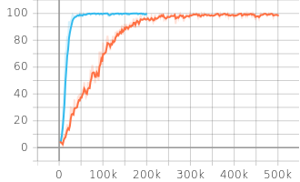|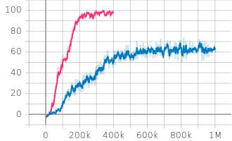|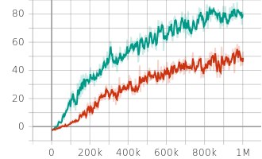|

值得注意的是，使用DA扩充数据，会增大对网络学习能力的要求。如下图所示，在保持原有网络的基础上使用DA（灰线），分数在上升后突然跌落，表现出欠拟合的现象，最终分数甚至较不使用DA的情况更低了：
|图示|Actor和Critic网络隐层|
|:---:|:---:|
|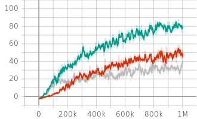|红（未使用DA）：[64,64] 和 [64,64] 绿（DA）：[64,128] 和 [64,64,32] 灰（DA）：[64,64] 和 [64,64]|

#### 欠拟合与过拟合的判断
<ul>
  <li>欠拟合：即网络学习能力不足，对好的轨迹学习不够，表现为持续的低奖励，或探索到高奖励后无法保持；</li>
  <li>过拟合：即网络学习能力过强，只拟合数据，而不是学到具有泛用性的特性。由于过度拟合，导致训练每一批数据时都会较大程度地更新参数，表现为频繁触发<code>target_kl</code>的训练“早停”机制。</li>
</ul>

### 更进一步：MCTS
MCTS，即蒙特卡洛树搜索，是一种结合了learning和planning，exploration和exploitation的方法，广泛应用于环境信息完全的场景。
在一些论文中，被认为是一种“策略优化算子”。
跟随这个思路，我们可以将MCTS应用于PPO算法中收集训练数据的模块中，替代直接从actor网络的输出中采样，以获得质量更高的幕轨迹。
具体来说，我们要：

- 改写标准Gym环境，需要一个能够输入状态和动作，输出后继状态的接口函数（
    [Code](https://github.com/wwsyan/RestMin_v1_solver/blob/main/ppo_mcts/env.py#L326)）；</li>
- 编/改写MCTS算法，调用上述的接口函数，和PPO的ActorCritic网络实现蒙特卡洛树的expand（
    [Code](https://github.com/wwsyan/RestMin_v1_solver/blob/main/ppo_mcts/mcts.py#L116)）；</li>
- 改写<code>Stable-Baselines3</code>的PPO算法文件，在<code>collect_rollouts</code>函数中调用MCTS（
    [Code](https://github.com/wwsyan/RestMin_v1_solver/blob/main/ppo_mcts/ppo_mcts.py#L334)）。</li>

另外，注意：
- MCTS的引入使得数据的收集变得非常慢，所以每一个batch的数据都十分宝贵，算法要有一定的断点传续功能。
    注意<code>Stable-Baselines3</code>中的PPO不具备该功能，需要改写；
- MCTS让数据变得更高质量的同时，也意味着更新前后策略差异会比较大，这时候“早停”机制反而限制了网络的更新。可以视情况将<code>target_kl</code>调高，或直接设置为<code>None</code>。
- 在一幕数据的收集中，保留蒙特卡洛树的新枝，只去掉旧枝，可能会提高训练效果（[Code](https://github.com/wwsyan/RestMin_v1_solver/blob/main/ppo_mcts/mcts.py#L215)）。
    
作为一个计算负担很重的策略优化的插件，我们最好是在合适的时候再去启用，而不是像AlphaZero那样从零开始。比如我们可以先用PPO跑一个底模，在此基础上启用MCTS。
下面的实验中，我们使用PPO预训练模型，跑<code>3e4</code>的步长来精进策略：
|奖励|散度|
|:---:|:---:|
|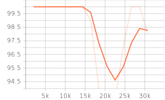|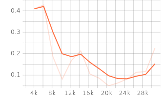|

可以看到在MCTS的帮助下，模型跑分接近满分，并且散度降低说明训练逐渐收敛。

## 模式1
由于模式1引入了双色棋子，因此多了异色棋子对换的等效性，与旋转、镜像组合起来一共是16种
（[Code](https://github.com/wwsyan/RestMin_v1_solver/blob/main/pg/callback_da.py#L127)）。

#### 随机网络蒸馏
即RND，是一种以内在奖励为驱动，鼓励探索的算法。可以作为插件，作用于PPO算法中计算奖励的模块。
我在 [Project](https://github.com/wwsyan/RND_for_RestMin_v1#rnd_for_restmin_v1) 中进行了实现，
实验发现，RND确实能找到最优解，但没法完成后续的exploitation。

| 图示 | 说明 |
|:---:|:---:|
||step=800k时出现了正的平均分，说明探索到了最优解|

#### 专家知识奖励
做出本尝试的想法是：能不能尽量不使用计算负担重的MCTS，只依靠一个关键性的、直击要害的奖励？
从个人游玩经验来说，同色棋子应该尽可能地靠近，这样成功的可能性是最大的。
直观来看，一个状态，如果同色棋子连成的“块”越少，就越好。
如下图所示，同色棋子连成的“块”数是5。
如何实现呢？我采用了类似扫雷游戏中展开无雷区的递归算法（[Code](https://github.com/wwsyan/RestMin_v1_solver/blob/main/pg/utils.py#L36)）。
修改过后的奖励是这样的：[Code](https://github.com/wwsyan/RestMin_v1_solver/blob/main/pg/env.py#L250)。

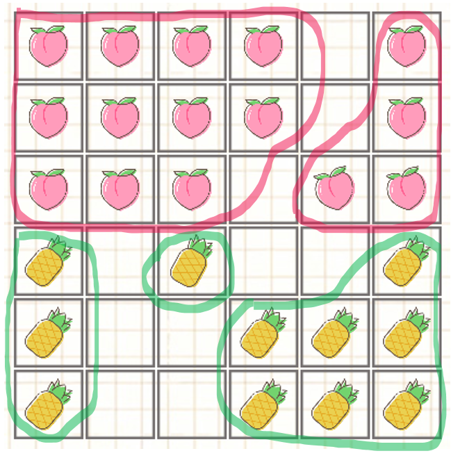

使用该奖励，我很意外地用比PPO性能更差的带基线的[PG](https://github.com/wwsyan/RestMin_v1_solver/blob/main/pg/pg.py)算法，
及一组不合理的参数，训练到了一个均分80的模型，并且很稳定，继续训练该模型不会出现“跌落”的现象。
比较遗憾的是日志没留意被训练平台清除了，只保留了模型的参数，而不知道是如何训练出来的。我尝试着复现，但都失败了：

|图示|说明|
|:---:|:---:|
|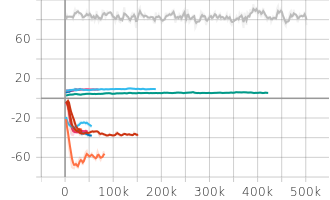|灰：意外训得的好模型|

#### 重视调参！一锤定音！
在mode0的PPO实验中，我一直使用<code>batch_size=2048</code>。由于效果不错，于是我很自然地在mode1的PPO中沿用了该参数，但尝试了一众其他参数及微调的奖励组合都效果很差：

|图示|说明|
|:---:|:---:|
|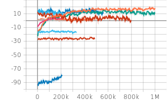|<code>batch_size=2048</code>|

然后发现在许多失败的实验中，都存在着“跌落”现象，并且伴随散度的激增，开始频繁“早停”。
我们知道，散度激增可能是网络过拟合数据导致的，但如果排除了网络复杂度，还会是什么原因呢？
那很大可能就是数据的原因了，请看下面实验：
|图示|legend|说明|
|:---:|:---:|:---:|
|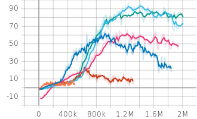|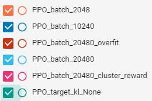|overfit指actor网络复杂度过高|
|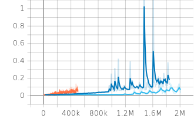|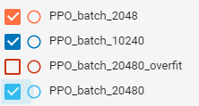|太小的<code>batch_size</code>造成了散度的异常|
|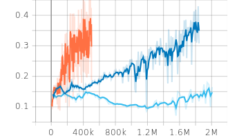||太小的<code>batch_size</code>造成了切除占比的异常|

可以看到，仅仅是把<code>batch_size</code>从2048换成20480，简单粗暴地提升数据丰富度，竟让分数提升如此显著！
更进一步地，观察到总是会在一定步数后，开始频繁触发“早停”，然后“跌落”，说明这时候<code>target_kl</code>反而限制了网络更新。
那干脆就直接让<code>target_k=None</code>，终于得到完美的高分且不跌落的曲线（绿线：PPO_target_kl_None）！。

