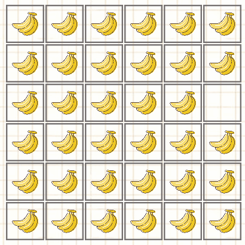

# RestMin_v1_solver
Try to solve enviroment RestMin_v1, in the framework of Stable-baselines3

## 环境介绍
该环境是一种中国古代棋的简化/魔改版本，分为两种模式。玩家经过一系列动作，减少棋盘中的棋子，终局时棋子剩得越少，得分越高。
<ul>
<li>模式0下，棋子皆为单色。棋子可以以相邻棋子作为跳板进行移动，移动后，跳板棋子移除。</li>
<li>模式1下，有双色棋子，棋子的移动规则同模式0，但只有跳板棋子与跳跃棋子同色时，才会被移除，反之会被保留。</li>
</ul>

| 模式 0 | 模式 1 |
| :---: | :---: |
|  |  |

### 终局条件
该棋的游玩版本和训练版本有着略微不同的终局条件。游玩版本中，终局判断函数会按顺序进行以下的判定：
<ol>
<li>若不存在合法动作，则死局（<b>第一死局充分条件</b>）；</li>
<li>若存在同色棋子消除，则非死局（<b>非死局充分条件</b>）；</li>
<li>
  对于两个同色棋子 $(x_1,y_1)$ 和 $(x_2,y_2)$，若不满足（ $\bmod$ 指取余）：
  $|x_1-x_2|=0 \land |y_1-y_2|\bmod2=1$ 或
  $|y_1-y_2|=0 \land |x_1-x_2|\bmod2=1$ 或
  $|x_1-x_2|=1 \land |y_1-y_2|\bmod2=0$ 或
  $|y_1-y_2|=1 \land |x_1-x_2|\bmod2=0$，
  那么该同色的棋子对无法进行同色消除。
  遍历所有同色的棋子对，若全都无法进行同色消除，那么死局（<b>第二死局充分条件</b>）；
</li>
<li>启用递归算法，遍历未来一定步数内的所有状态，并进行非死局充分条件的判定，若存在非死局状态，则判定为非死局。</li>
</ol>

使用该组合判定的原因是：
<ol>
<li>未找到死局的充分必要条件，只找到一些充分条件；</li>
<li>可以仅使用一个足够深的递归判定来满足需要，但会带来较严重的卡顿，影响体验。</li>
</ol>

